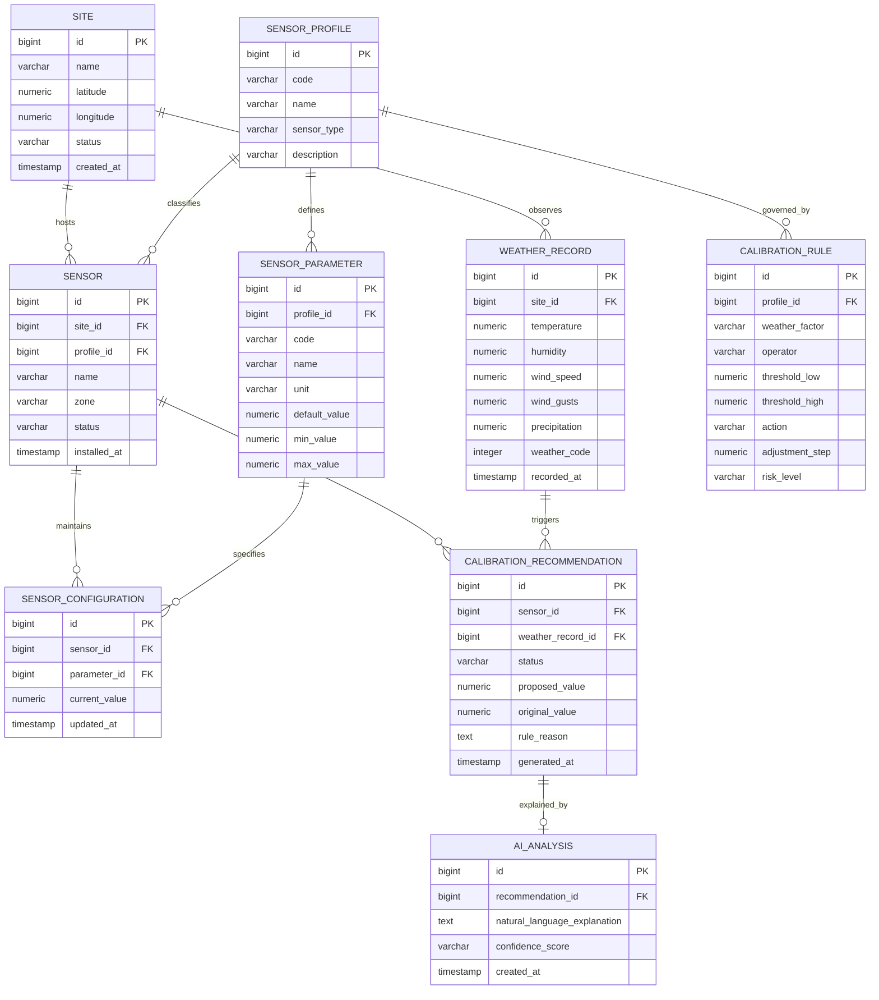
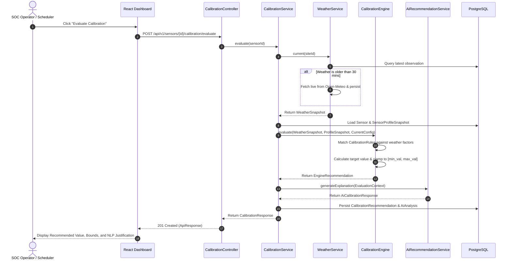

# VigilSense System Architecture Specification

## 1. Architectural Overview & Design Philosophy

**VigilSense** is designed as a mission-critical, cyber-physical intelligence platform for Perimeter Intrusion Detection Systems (PIDS). Perimeter security systems operate in hostile physical environments where false positives (False Alarm Rate - FAR) erode operator trust, and false negatives (Nuisance Alarm Rate - NAR) create catastrophic physical security breaches.

The architectural principles governing VigilSense include:

1. **Deterministic Defense with Explainable AI (XAI)**:
   Safety-critical parameter adjustments are governed by deterministic, verifiable rules. Artificial intelligence is utilized for natural language explanation and contextual correlation, ensuring the platform remains fully explainable and auditable.
2. **Hardware Boundary Clamping (Fail-Safe Pinning)**:
   The recommendation engine can never suggest a parameter setting that violates the physical operating envelope (`min_value`, `max_value`) defined by the sensor manufacturer.
3. **Zero-Key Tactical Geospatial Visualisation**:
   Perimeter monitoring maps leverage Leaflet and OpenStreetMap raster tiles without relying on commercial third-party cloud mapping keys, preventing external telemetry leakage and vendor lock-in.
4. **Immutable Audit Trails**:
   Every parameter evaluation, modification proposal, and manual override is logged through Spring AOP interceptors into tamper-evident storage for forensic accountability.

---

## 2. High-Level System Architecture

VigilSense employs a decoupled **3-Tier Architecture**:

```mermaid
flowchart TD
    subgraph Client ["Tier 1: Presentation Layer (Port 5173)"]
        SPA["Single Page Application (React 19 + TypeScript)"]
        DashboardView["Operations Dashboard"]
        SiteView["Perimeter GIS & Site Management"]
        SensorView["Sensor Fleet & Configuration"]
        CalibrationCenter["Calibration Evaluation Center"]
        SimulatorView["Environmental Sandbox Simulator"]
        AnalyticsView["FAR Reduction Analytics"]
        LeafletMap["Leaflet GIS (Tactical Dark/Light OSM Tiles)"]
    end

    subgraph Backend ["Tier 2: Application Service Layer (Port 8081)"]
        Gateway["Spring MVC REST Dispatcher (/api/v1/*)"]
        
        subgraph Services ["Core Business Services"]
            SiteService["SiteService"]
            SensorService["SensorService & ProfileService"]
            WeatherService["WeatherService (Cache & Staleness Manager)"]
            Engine["CalibrationEngine (Deterministic Rule Evaluator)"]
            AiService["AiRecommendationService (Contextual NLP)"]
            AnalyticsService["AnalyticsService (Correlation & Reporting)"]
        end

        subgraph Interceptors ["Cross-Cutting Concerns (AOP)"]
            AuditAspect["@Auditable AuditAspect"]
            LoggingAspect["LoggingAspect (Performance & Traceability)"]
            GlobalExceptionHandler["GlobalExceptionHandler (@RestControllerAdvice)"]
        end
    end

    subgraph DataTier ["Tier 3: Persistence & Intelligence Layer"]
        Postgres[("PostgreSQL 15+ (HikariCP Connection Pool)")]
        Flyway["Flyway Migration Engine (V1 - V9)"]
        OpenMeteo["Open-Meteo Atmospheric Weather API (TLS 1.3)"]
    end

    SPA -->|JSON REST Requests| Gateway
    Gateway --> Services
    AuditAspect -.->|Intercepts| Services
    LoggingAspect -.->|Measures| Services

    SiteService --> Postgres
    SensorService --> Postgres
    WeatherService --> Postgres
    WeatherService -->|Outbound HTTPS (5s Connect, 10s Read)| OpenMeteo
    Engine --> Postgres
    AiService --> Postgres
    AnalyticsService --> Postgres
    Flyway --> Postgres
    LeafletMap -.->|Tile Requests| OpenMeteo
```

---

## 3. Component Deep Dive

### 3.1 Presentation Layer (Frontend)
- **Framework**: React 19 with TypeScript 5, Vite 6, and Tailwind CSS v4.
- **State & Theme**: Dynamic dark/tactical mode switching via `ThemeContext`.
- **Geospatial Mapping**:
  - `Leaflet` integration utilizing standard OpenStreetMap raster tiles (`https://tile.openstreetmap.org/{z}/{x}/{y}.png`).
  - Dark-mode shader simulation via CSS filter (`filter: invert(100%) hue-rotate(180deg) brightness(85%) contrast(90%)`).
  - Multi-tier continuous perimeter zoning:
    - **Outer Warning Zone**: 800-meter continuous contour (Cyan `#06b6d4`).
    - **Exclusion Zone**: 400-meter continuous contour (Amber `#f59e0b`).
    - **Core Facility Zone**: 150-meter continuous contour (Rose `#f43f5e`).
  - Clean tactical presentation: Attribution text overlay suppressed (`attributionControl: false`) and legend card removed from active map viewports.

### 3.2 Application Service Layer (Backend)
- **Runtime**: OpenJDK 21 LTS with Spring Boot 3.5.x.
- **REST Dispatcher**: Base URI `/api/v1/` with unified response envelope `ApiResponse<T>`.
- **Weather Ingestion (`WeatherService`)**:
  - Outbound calls to Open-Meteo using Spring `RestClient` configured with connection and read timeouts.
  - Automatic staleness detection: observations older than 30 minutes are stamped with `isStale = true`.
  - Offline / fallback resilience: when external weather APIs are unreachable, the latest known persisted weather record is returned with warning annotations.
- **Calibration Engine (`CalibrationEngine`)**:
  - Analyzes current weather snapshot against active sensor profiles and parameters.
  - Matches rule conditions (`GREATER_THAN`, `LESS_THAN`, `BETWEEN`) against weather metrics (`WIND_SPEED`, `RAINFALL`, `TEMPERATURE`, `HUMIDITY`, `STORM_CODE`).
  - Computes proposed adjustment (`INCREASE`, `DECREASE`, `MAINTAIN`) and clamps values to the hardware envelope.
- **Explainable AI Layer (`AiRecommendationService` & `LlmAiClient`)**:
  - Synthesizes meteorological readings, sensor hardware types, and proposed adjustments into human-readable tactical rationales for SOC operators.
- **Cross-Cutting Aspects**:
  - `@Auditable`: Intercepts state modifications, recording user context, parameters, and timestamps.
  - `LoggingAspect`: Captures method entry, exit, arguments, execution duration (ms), and exception stacks.

### 3.3 Persistence Layer (Database)
- **Engine**: PostgreSQL 15+ managed with **Flyway** schema migrations:
  - `V1__create_sites.sql`: Facilities and coordinates.
  - `V2__create_sensor_profiles.sql`: Hardware sensor model taxonomy.
  - `V3__create_sensor_parameters.sql` & `V3_1__seed_sensor_profiles.sql`: Tunable parameters, units, bounds, and baseline values.
  - `V4__create_sensors.sql`: Site-specific sensor installations.
  - `V5__create_sensor_configurations.sql`: Active parameter state per sensor.
  - `V6__create_weather_records.sql`: Ingested meteorological observations.
  - `V7__create_calibration_rules.sql` & `V7_1__seed_calibration_rules.sql`: Deterministic thresholds and adjustments.
  - `V8__create_calibration_recommendations.sql`: Generated tuning proposals and operator review status.
  - `V9__create_ai_analysis.sql`: NLP explanation logs and reasoning records.

---

## 4. Entity Relationship Diagram (ERD)



---

## 5. Calibration Recommendation Pipeline

The recommendation engine executes through a closed-loop sequential pipeline:



---

## 6. Safety Pinning & Clamping Algorithm

To guarantee that automated calibration recommendations never place a sensor into an uncalibrated or unsafe operating state, the engine applies the **Boundary Clamping Function**:

$$V_{\text{proposed}} = \min\left(V_{\text{max}}, \max\left(V_{\text{min}}, V_{\text{current}} + \Delta_{\text{rule}}\right)\right)$$

Where:
- $V_{\text{current}}$ is the active parameter value recorded in `sensor_configurations`.
- $\Delta_{\text{rule}}$ is the directional adjustment step determined by matching environmental conditions.
- $V_{\text{min}}$ and $V_{\text{max}}$ are strict physical hardware limits defined in `sensor_parameters`.

If $V_{\text{proposed}} == V_{\text{current}}$, the action is resolved to `MAINTAIN` with a status indicating that the sensor is already at optimal boundary bounds for the current environmental conditions.

---

## 7. Geospatial Continuous Contour Perimeter Model

Perimeter security requires clear spatial containment to differentiate between warning alarms and active physical perimeter intrusions:

1. **Outer Warning Zone (Radius: 800m)**:
   Early detection layer. Gathers atmospheric advance alerts, micro-bursts, and heavy rain fronts moving towards the perimeter.
2. **Exclusion Zone (Radius: 400m)**:
   Buffer layer between perimeter boundaries and facility grounds. Filters acoustic ground vibrations caused by passing rail, highway traffic, or wind-blown debris.
3. **Core Facility Zone (Radius: 150m)**:
   Physical boundary fence and inner sterile zone. Highest criticality; any sensor desensitization in this zone is strictly constrained to prevent physical defeat.

---

## 8. Resilience, Observability & Performance

- **Outbound HTTP Resilience**:
  - Connect Timeout: 5,000 ms.
  - Read Timeout: 10,000 ms.
  - Fallback: Gracefully utilizes cached observation if external weather APIs experience outages.
- **Audit Logging via Spring AOP**:
  - Methods annotated with `@Auditable` automatically serialize invocation metadata and persist records.
- **Performance Profiling**:
  - `LoggingAspect` logs method execution duration. Invocations taking $>500$ ms trigger `WARN` alerts for proactive optimization.
- **Stateless Scaling**:
  - The Spring Boot application server is completely stateless, enabling horizontal scaling behind an NGINX or AWS ALB load balancer.
