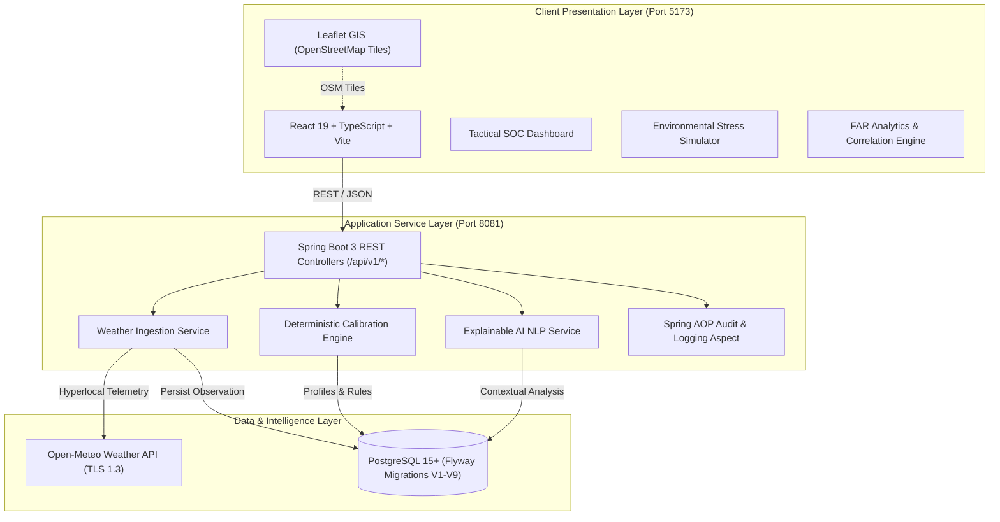

# V I G I L — Perimeter Intrusion Detection & Weather Calibration Intelligence

[](LICENSE)
[](https://spring.io/projects/spring-boot)
[](https://openjdk.org/)
[](https://react.dev/)
[](https://www.typescriptlang.org/)
[](https://vitejs.dev/)
[](https://www.postgresql.org/)
[](https://tailwindcss.com/)

**VigilSense** is an enterprise-grade Perimeter Intrusion Detection System (PIDS) atmospheric correlation and dynamic calibration recommendation platform. It autonomously monitors meteorological conditions surrounding critical infrastructure facilities (refineries, data centers, maritime ports, high-security perimeters) and calculates mathematically safe, profile-pinned sensor sensitivity adjustments to suppress False Alarm Rates (FAR) while eliminating Nuisance Alarm Rates (NAR) and perimeter detection blind spots.


## 📑 Table of Contents

- [Executive Summary](#-executive-summary)
- [Key Features](#-key-features)
- [System Architecture](#-system-architecture)
- [Tech Stack](#-tech-stack)
- [Getting Started](#-getting-started)
  - [Prerequisites](#prerequisites)
  - [Port Configuration](#port-configuration)
  - [Local Development Setup](#local-development-setup)
  - [Docker Compose Deployment](#docker-compose-deployment)
- [Project Directory Layout](#-project-directory-layout)
- [Documentation Suite](#-documentation-suite)
- [Contributing](#-contributing)
- [Security](#-security)
- [License](#-license)


## 🎯 Executive Summary

Perimeter security installations depend on heterogeneous physical sensors—such as fence-mounted vibration geophones, buried fiber-optic cables, microwave Doppler barriers, and infrared beam detectors. During severe weather events (gale-force wind gusts, tropical downpours, lightning blizzards, temperature inversion fog), physical fences flex and acoustic ground noise surges.

Without intelligent calibration, Security Operations Centers (SOCs) experience:
1. **False Alarm Storms (FAR)**: Hundreds of nuisance alerts per hour, overwhelming operators and inducing alert fatigue.
2. **Detection Blind Spots (NAR)**: Operators manually muting or lowering sensitivity across the entire facility without rigorous hardware-bound pinning, creating undetected physical breach vulnerabilities.

**VigilSense solves this** through an automated, closed-loop telemetry pipeline:
- **Atmospheric Telemetry Ingestion**: Ingests real-time, hyperlocal weather (wind, gusts, precipitation, temperature, relative humidity, pressure, WMO weather codes) via Open-Meteo.
- **Continuous Geospatial Perimeter Zoning**: Multi-tier visual zoning (800m outer early-warning, 400m exclusion, 150m core zone) on Leaflet + OpenStreetMap without commercial API keys.
- **Deterministic Rule Engine**: Matches weather impact thresholds against sensor hardware models with strict parameter boundary clamping (`[min_value, max_value]`).
- **Explainable AI Justification**: Contextual natural language explanations generated for every proposed calibration adjustment.
- **Audit-Logged Operator Confirmation**: Zero unverified parameter shifts; all adjustments maintain complete cryptographic and AOP audit trails.


## ⚡ Key Features

- **🌐 Hyperlocal Meteorological Telemetry**: Autonomous weather ingestion with automated staleness detection (>30 minutes flags stale cache).
- **🗺️ Zero-Key Tactical Perimeter GIS**: Continuous contour line visualization of multi-zone perimeters with zero external commercial dependencies and zero watermarks.
- **⚙️ Profile-Backed Hardware Pinning**: Pre-calibrated hardware profiles (Geophone, Fiber-Optic, Microwave Barrier, PIR, Radar, Video Analytics) enforce physical limits on sensitivity and threshold adjustments.
- **🧪 Environmental Stress Simulator**: Interactive sandbox to simulate hurricane-force winds, monsoons, blizzards, and heatwaves with live rule engine response validation.
- **📊 Predictive Analytics & Correlation Matrix**: Live telemetry charting, False Alarm Rate (FAR) reduction metrics, and downloadable operational compliance reports.
- **🛡️ Enterprise SOC Hardening**: Role-based access control readiness, CORS domain whitelisting, SQL-injection prevention, and Spring AOP audit interceptors.


## 🏗️ System Architecture



For complete technical specifications, class hierarchies, and database entity relationships, refer to [ARCHITECTURE.md](ARCHITECTURE.md).


## 💻 Tech Stack

| Layer | Technologies |
| :--- | :--- |
| **Frontend** | React 19, TypeScript 5, Vite 6, Tailwind CSS v4, Lucide React, Leaflet 1.9, OpenStreetMap |
| **Backend** | Java 21 LTS, Spring Boot 3.5.x, Spring Data JPA, Spring Validation, Spring AOP, HikariCP |
| **Database** | PostgreSQL 15+, Flyway Migration Engine (V1 through V9) |
| **External APIs** | Open-Meteo Weather API (Open-source, no API key required) |
| **DevOps & Tooling** | Docker, Docker Compose, Maven 3.9+, Node.js 20+ |


## 🚀 Getting Started

### Prerequisites

Ensure the following tools are installed on your workstation:
- **Java Development Kit (JDK)**: 21 LTS or newer
- **Apache Maven**: 3.9+
- **Node.js**: 20+ (LTS) & **npm**: 10+
- **PostgreSQL**: 15+ (or Docker)


### Port Configuration

VigilSense is configured to operate on standardized development ports:

| Service | Protocol | Host / Port | Environment Variable | Configuration Location |
| :--- | :--- | :--- | :--- | :--- |
| **Frontend Console** | HTTP | `http://localhost:5173` | `VITE_PORT=5173` | [`app/client/.env`](app/client/.env) |
| **Backend API** | HTTP | `http://localhost:8081` | `SERVER_PORT=8081` | [`app/server/.env`](app/server/.env), [`application.yml`](app/server/src/main/resources/application.yml) |
| **Database** | TCP | `localhost:5432` | `DATABASE_URL` | [`app/server/.env`](app/server/.env) |


### Local Development Setup

#### 1. Database Provisioning
Create the PostgreSQL database and ensure credentials match your configuration:
```sql
CREATE DATABASE vigilsense;
```

#### 2. Backend Initialization (Spring Boot)
Navigate to the server directory, review configuration, and start the service:
```bash
cd app/server
mvn clean spring-boot:run
```
*The Spring Boot server will compile, run Flyway migrations (V1–V9), seed initial facility profiles (Mumbai Refinery, Delhi Data Center, Dover Maritime Terminal), and bind to port `8081`.*

Verify backend liveness:
```bash
curl http://localhost:8081/api/v1/health
# Response: {"code":200,"message":"SUCCESS","data":{"status":"UP"},"timestamp":"..."}
```

#### 3. Frontend Initialization (React + Vite)
In a separate terminal, navigate to the client directory and start the Vite development server:
```bash
cd app/client
npm install
npm run dev
```
*Open your browser and navigate to `http://localhost:5173`.*


### Docker Compose Deployment

To stand up the complete stack (PostgreSQL + Spring Boot Backend) with a single command:

```bash
docker-compose up -d --build
```

To inspect container logs:
```bash
docker-compose logs -f server
```

To shut down the environment:
```bash
docker-compose down -v
```


## 📁 Project Directory Layout

```
Vigil/
├── app/
│   ├── client/                      # React 19 + TypeScript + Vite Frontend
│   │   ├── src/
│   │   │   ├── api/                 # Strongly typed Axios/Fetch API client bindings
│   │   │   ├── components/          # Reusable tactical UI components, Navbars, Cards
│   │   │   ├── context/             # ThemeContext (Dark/Light mode), SOC State
│   │   │   ├── pages/               # Dashboard, Sites, Sensors, Calibration, Simulator, Analytics
│   │   │   ├── App.tsx              # Application route orchestrator
│   │   │   └── main.tsx             # DOM mounting entrypoint
│   │   ├── .env                     # Client environment configuration (port 5173, backend 8081)
│   │   ├── package.json             # Frontend dependency manifest
│   │   └── vite.config.ts           # Vite bundler configuration & reverse-proxy rules
│   │
│   └── server/                      # Spring Boot 3 + Java 21 Backend Application
│       ├── src/main/java/com/vigilsense/
│       │   ├── ai/                  # Explainable AI contextual explanation service
│       │   ├── analytics/           # Environmental analytics & reporting controller/service
│       │   ├── aspect/              # Spring AOP Audit & Logging aspects
│       │   ├── calibration/         # Deterministic rule engine, evaluators, and recommendations
│       │   ├── common/              # API envelopes, global exception handlers, health checks
│       │   ├── config/              # CORS, RestClient, and OpenAPI bean configuration
│       │   ├── sensor/              # Sensor fleet registry & current parameter state
│       │   ├── sensor_profile/      # Hardware profile specifications & boundary limits
│       │   ├── site/                # Monitored physical facilities & coordinates
│       │   └── weather/             # Open-Meteo client, cache management, and history
│       ├── src/main/resources/
│       │   ├── db/migration/        # Flyway SQL migrations (V1 through V9)
│       │   └── application.yml      # Spring Boot active profile & property configuration
│       ├── .env                     # Server environment variables (port 8081, DB credentials)
│       └── pom.xml                  # Maven build and dependency manifest
│
├── ARCHITECTURE.md                  # Comprehensive technical architecture & design specification
├── API.md                           # Complete REST API specification & curl documentation
├── SECURITY.md                      # Vulnerability disclosure policy & cyber-physical threat model
├── LICENSE                          # Apache License Version 2.0
├── CODE_OF_CONDUCT.md               # Contributor Covenant Code of Conduct (v2.1)
├── SRD.md                           # System Requirements Specification & Case Study Baseline
└── docker-compose.yml               # Container orchestration definition
```


## 📚 Documentation Suite

For deeper exploration of system capabilities, review the dedicated guides:

| Document | Purpose |
| :--- | :--- |
| **[WORKFLOW.md](WORKFLOW.md)** | Operational walkthrough, step-by-step user guide, standard operating procedures, and tactical scenarios. |
| **[ARCHITECTURE.md](ARCHITECTURE.md)** | Deep architectural breakdown, data flow sequence diagrams, clamping algorithms, and database ER models. |
| **[API.md](API.md)** | Full REST endpoint reference, JSON request/response schemas, HTTP status codes, and curl examples. |
| **[SECURITY.md](SECURITY.md)** | PIDS threat model, sensor blinding defense, tamper resistance, and vulnerability disclosure SLAs. |
| **[PROJECT_COMPLETION_REPORT.md](PROJECT_COMPLETION_REPORT.md)** | Final verification and acceptance report validating all 15 SRD criteria. |
| **[SRD.md](SRD.md)** | Official Software Requirements Specification derived from the A-1 Launchpad case study. |
| **[LICENSE](LICENSE)** | Apache License 2.0 terms and conditions. |
| **[CODE_OF_CONDUCT.md](CODE_OF_CONDUCT.md)** | Contributor community standards and enforcement guidelines. |


## 🤝 Contributing

We welcome contributions from security engineers, systems architects, and open-source contributors! Please follow our standardized development workflow:

1. **Fork the Repository** to your personal GitHub account.
2. **Create a Feature Branch**: `git checkout -b feature/advanced-sensor-telemetry`.
3. **Commit Your Changes**: Follow conventional commits (`feat: add optical fiber strain calibration model`).
4. **Validate Code Integrity**: Ensure `mvn test` passes and `npm run build` succeeds cleanly.
5. **Open a Pull Request**: Provide a clear summary of changes and reference relevant issues.

Please review our [CODE_OF_CONDUCT.md](CODE_OF_CONDUCT.md) before participating in discussions.


## 🔒 Security

For instructions on reporting security vulnerabilities or reviewing our perimeter cyber-physical threat model, consult [SECURITY.md](SECURITY.md).


## 📄 License

VigilSense is open-source software licensed under the **Apache License, Version 2.0**. See the [LICENSE](LICENSE) file for complete details.
