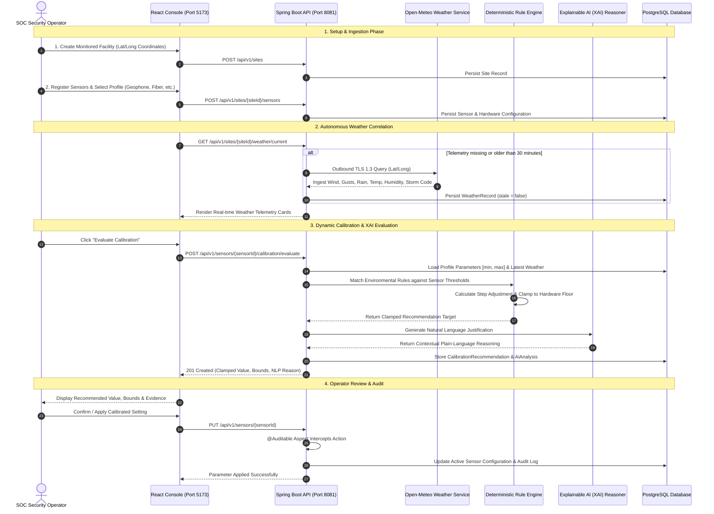
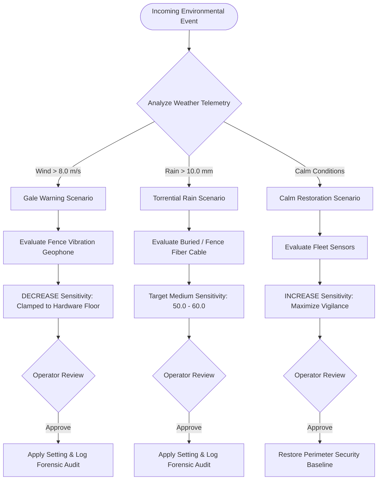

# VigilSense — Operational Workflow & User Guide

**System**: VigilSense Perimeter Intrusion Detection & Weather Calibration Intelligence Platform  
**Target Audience**: Security Operations Center (SOC) Operators, Physical Security Engineers, System Administrators  
**Version**: 1.0.0 (Production Release)  
**Related Specifications**: [ARCHITECTURE.md](ARCHITECTURE.md) • [API.md](API.md) • [SECURITY.md](SECURITY.md) • [SRD.md](SRD.md)

---

## 📑 Table of Contents

1. [Executive Operating Philosophy](#1-executive-operating-philosophy)
2. [End-to-End System Workflow Architecture](#2-end-to-end-system-workflow-architecture)
3. [Operator Step-by-Step User Manual](#3-operator-step-by-step-user-manual)
   - [Step 1: Facility Onboarding & Perimeter Mapping](#step-1-facility-onboarding--perimeter-mapping-sites)
   - [Step 2: Sensor Fleet Enrollment & Parameter Baseline](#step-2-sensor-fleet-enrollment--parameter-baseline-sensors)
   - [Step 3: Atmospheric Telemetry Ingestion](#step-3-atmospheric-telemetry-ingestion-dashboard--sites)
   - [Step 4: Calibration Evaluation & XAI Audit](#step-4-calibration-evaluation--xai-audit-calibration)
   - [Step 5: Environmental Sandbox Stress-Testing](#step-5-environmental-sandbox-stress-testing-simulator)
   - [Step 6: Observability, FAR Analytics & Reports](#step-6-observability-far-analytics--reports-analytics)
   - [Step 7: System Diagnostics, Citations & Live Logs](#step-7-system-diagnostics-citations--live-logs-settings)
4. [Standard Operating Procedures (Tactical Scenarios)](#4-standard-operating-procedures-tactical-scenarios)
   - [Scenario A: Severe Gale-Force Wind Event](#scenario-a-severe-gale-force-wind-event-high-wind)
   - [Scenario B: Torrential Monsoon Rainstorm](#scenario-b-torrential-monsoon-rainstorm-heavy-rain)
   - [Scenario C: Post-Storm Weather Clearance](#scenario-c-post-storm-weather-clearance-normal-calm)
5. [Safety Clamping & Intelligence Logic](#5-safety-clamping--intelligence-logic)
6. [Failure Modes & Emergency Fallback Protocols](#6-failure-modes--emergency-fallback-protocols)

---

## 1. Executive Operating Philosophy

Physical Perimeter Intrusion Detection Systems (PIDS)—such as fence-mounted vibration geophones, buried coherent optical fiber, microwave Doppler barriers, and perimeter radar—are constantly subjected to outdoor environmental forces. High winds induce fence vibration resonance; torrential precipitation produces surface acoustic noise; temperature inversions trigger optical refraction drift.

Traditional security setups face a dangerous dilemma:
1. **Uncalibrated Systems**: Experience **False Alarm Storms (FAR)** where hundreds of weather-induced alarms inundate the SOC, causing operator fatigue and missed intrusions.
2. **Indiscriminate Desensitization**: Operators arbitrarily lower sensitivity across the board, causing **Nuisance Alarm Rates (NAR)** and creating unmonitored blind spots where an intruder can breach the perimeter undetected.

### The VigilSense Paradigm:
> **"Site-Driven, Sensor-Aware, Deterministically Safe, and Explainable."**

- **Site-Driven**: Facility coordinates autonomously determine which localized micro-climate telemetry is retrieved.
- **Sensor-Aware**: Calibrations are governed strictly by the sensor's physical profile (`min_value`, `max_value`, supported parameters). The system never proposes adjustments on unsupported hardware capabilities.
- **Deterministically Safe**: Adjustments follow mathematically bounded rules. Parameters are clamped within hardware safety floors:
  $$V_{\text{proposed}} = \min\left(V_{\max}, \max\left(V_{\min}, V_{\text{current}} + \Delta_{\text{rule}}\right)\right)$$
- **Explainable AI (XAI)**: Every recommendation is paired with verifiable atmospheric evidence and contextual natural language justifications.
- **Operator-in-the-Loop**: The platform provides dynamic intelligence proposals; changes are reviewed and confirmed with immutable cryptographic audit logging via Spring AOP.

---

## 2. End-to-End System Workflow Architecture

The following sequence details how telemetry flows from satellite models to physical sensor adjustments:



---

## 3. Operator Step-by-Step User Manual

### Step 1: Facility Onboarding & Perimeter Mapping (`/sites`)

1. Open your browser and navigate to `http://localhost:5173/sites`.
2. Click **"Register Monitored Facility"** in the upper-right corner.
3. Enter the facility identity:
   - **Facility Name**: e.g., `Mumbai Refinery Facility` or `North Border Checkpoint`.
   - **Location Description**: Physical address or sector designation.
   - **GPS Coordinates**: Decimal Latitude (`-90.0` to `90.0`) and Longitude (`-180.0` to `180.0`).
4. Click **"Save Facility"**.
5. **Inspect Continuous Contour GIS Map**:
   - The facility appears instantly on the tactical OpenStreetMap canvas.
   - Observe the **Continuous Multi-Tier Perimeter Contours**:
     - 🔵 **Outer Warning Zone (800m contour)**: Atmospheric advance radar layer.
     - 🟡 **Exclusion Zone (400m contour)**: Perimeter vehicle buffer zone.
     - 🔴 **Core Facility Zone (150m contour)**: Inner sterile perimeter fence boundary.
6. Click **"Refresh Live Telemetry"** to initiate the first weather capture.

---

### Step 2: Sensor Fleet Enrollment & Parameter Baseline (`/sensors`)

1. Navigate to **Sensor Fleet** (`/sensors`).
2. Click **"Deploy Hardware Sensor"**.
3. Select the **Host Site** and the **Hardware Sensor Profile**:
   - `GEO-PIDS-V2`: Fence-mounted vibration geophone array (Parameters: `sensitivity`, `cut_threshold`).
   - `FIBER-OPTIC-PIDS`: Fence & buried coherent OTDR optical strain cable (Parameters: `strain_threshold`, `event_window`).
   - `MICROWAVE-PIDS`: Doppler microwave volumetric barrier (Parameters: `beam_sensitivity`, `cutoff_frequency`).
   - `RADAR-PIDS`: Wide-area tactical ground surveillance radar (Parameters: `rcs_threshold`, `track_filter`).
4. Set the **Physical Sector**: e.g., `Sector Alpha (North Perimeter Fence)`.
5. Enter the **Initial Hardware Configuration** values within manufacturer bounds.
6. Click **"Enroll Sensor"**. The asset is registered with state `ACTIVE`.

---

### Step 3: Atmospheric Telemetry Ingestion (`/dashboard` & `/sites`)

1. Navigate to the **Operational Dashboard** (`/dashboard`).
2. Select your site from the top-center facility dropdown.
3. Review the **Live Weather Telemetry Cards**:
   - 🌡️ **Temperature**: Ambient thermal conditions (°C).
   - 💧 **Relative Humidity**: Moisture content percentage (%).
   - 🌧️ **Precipitation**: Rainfall rate (mm/h).
   - 💨 **Wind Speed & Peak Gusts**: Sustained velocity and burst gusts (m/s).
   - ⛈️ **Storm Condition Indicator**: Automated WMO severe weather classification.
4. **Staleness Guard**:
   - If telemetry is older than 30 minutes, the card indicates `STALE FEED (>30M)`.
   - Click the **"Sync Live Weather"** button to force an instant Open-Meteo refresh.

---

### Step 4: Calibration Evaluation & XAI Audit (`/calibration`)

1. Navigate to the **Calibration Center** (`/calibration`).
2. Select the sensor requiring calibration from the fleet registry.
3. Click **"Evaluate Environmental Calibration"**.
4. The system evaluates the live weather snapshot against the sensor's rule matrix:
   - **Action Displayed**: `DECREASE`, `INCREASE`, or `MAINTAIN`.
   - **Target Proposed Value**: Mathematically clamped within `recommendedMin` and `recommendedMax`.
   - **Deterministic Rationale**: Bulleted conditions that matched (e.g., *"Wind speed 12.5 m/s exceeds threshold 8.0 m/s"*).
   - **Explainable AI Contextual Justification**: Natural language explanation generated for human operators explaining *why* the mechanical or electromagnetic behavior of the sensor warrants the adjustment.
5. Click **"Apply Recommended Parameter"** to confirm the update, or choose **"Manual Override"** to input a custom operator-verified value within bounds.
6. The adjustment is cryptographically timestamped and saved into PostgreSQL.

---

### Step 5: Environmental Sandbox Stress-Testing (`/simulator`)

The **Weather Simulator** enables operators to test sensor resilience before real storms occur:

1. Navigate to **Weather Simulator** (`/simulator`).
2. Select a target sensor profile (e.g., *Fence Geophone Array*).
3. Choose a **Preset Meteorological Scenario**:
   - **Severe Gale Warning**: 24.5 m/s wind bursts, 0 mm rain.
   - **Monsoon Torrent**: 45.0 mm torrential downpour, 14.0 m/s wind.
   - **Arctic Blizzard**: -12°C freezing cold, 18.0 m/s wind, 15.0 mm frozen precipitation.
   - **Dense Radiation Fog**: 98% relative humidity, 0.5 m/s calm wind.
   - **Extreme Heatwave**: 46.5°C scorching temperature, 15% humidity.
4. Alternatively, use the **Interactive Sliders** to customize custom wind, rain, and temperature variables.
5. Click **"Simulate Engine Evaluation"**.
6. Review the **Real-Time Predictive Response**:
   - Observe how the engine calculates the adjustment step without altering production field databases.
   - Verify that proposed values strictly respect the sensor's physical limits.

---

### Step 6: Observability, FAR Analytics & Reports (`/analytics`)

1. Navigate to **Observability** (`/analytics`).
2. Review the **False Alarm Rate (FAR) Reduction KPI**:
   - Quantifies the estimated percentage of nuisance alarms averted by dynamic calibration.
3. Review the **Environmental Correlation Matrix**:
   - Correlates wind speed tiers and rainfall rates against calibration activity.
4. Review the **Action Distribution & Risk Breakdown**:
   - Visualizes the proportion of `DECREASE`, `INCREASE`, and `MAINTAIN` operations.
5. Click **"Export Operational Report"** to download an executive summary containing recent weather observations, sensor health states, and audit trails.

---

### Step 7: System Diagnostics, Citations & Live Logs (`/settings`)

1. Navigate to **System Engine** (`/settings`).
2. **Engine Diagnostics Tab**:
   - Inspect Spring Boot core liveness (`UP` on Port 8081).
   - Verify PostgreSQL connection pool status and Flyway migrations (11 migrations applied).
   - Inspect hardware profile specifications and active parameter contracts.
3. **Third-Party, API & AI Acknowledgements Tab**:
   - Inspect formal citations for Open-Meteo, Leaflet, OpenStreetMap, Spring Boot, PostgreSQL, and Explainable AI.
   - Access direct links to official documentation and open-source licenses.
4. **Rule Engine & AI Logs Console Tab**:
   - Monitor real-time streaming engine logs.
   - Filter by subsystem (`RULE_ENGINE`, `AI_ENGINE`, `WEATHER_API`, `AUDIT_TRAIL`).
   - Click **"Simulate Live Evaluation"** to trigger a real-time event injection into the terminal.
   - Click the clipboard icon on any row to copy the forensic trace.

---

## 4. Standard Operating Procedures (Tactical Scenarios)



---

### Scenario A: Severe Gale-Force Wind Event (`HIGH WIND`)

* **Situation**: Incoming squall line triggers wind gusts exceeding $18\text{ m/s}$ ($65\text{ km/h}$) at the Mumbai Refinery. Chain-link security fences begin vibrating aggressively, creating acoustic resonance spikes.
* **SOP Steps**:
  1. Open the **Dashboard** (`/dashboard`); verify that wind speed reads $> 8.0\text{ m/s}$ with `Storm Condition = YES`.
  2. Navigate to **Calibration Center** (`/calibration`); select `North Fence Geophone Array`.
  3. Click **"Evaluate Calibration"**.
  4. Verify the recommendation:
     - **Action**: `DECREASE`
     - **Parameter**: `sensitivity`
     - **Current Value**: `75.0` $\rightarrow$ **Proposed Target**: `55.0`
     - **Clamped Range**: Minimum allowed floor is `10.0`; proposed value `55.0` is well within safety bounds.
     - **AI Justification**: *"Reduced sensitivity is recommended due to aerodynamic fence flexure to prevent false intrusion alarms while maintaining climb-over detection thresholds."*
  5. Click **"Apply Recommended Parameter"**.
  6. Confirm on the terminal logs that `RULE-EXEC` and `AUDIT` events are recorded.

---

### Scenario B: Torrential Monsoon Rainstorm (`HEAVY RAIN`)

* **Situation**: Monsoon storm dumps $35\text{ mm}$ of rain per hour. Water droplets strike optical fiber cables along the fence perimeter, creating acoustic surface noise.
* **SOP Steps**:
  1. Verify the precipitation widget indicates $> 10.0\text{ mm}$ rainfall.
  2. In the **Calibration Center**, select `South Perimeter Fiber-Optic Cable`.
  3. Click **"Evaluate Calibration"**.
  4. Verify the recommendation:
     - **Action**: Target medium sensitivity corridor (`50.0` to `60.0`).
     - **Parameter**: `strain_threshold`
     - **Rule Reason**: Heavy water droplet percussion triggers high-frequency noise filters.
  5. Click **"Apply Recommended Parameter"**.
  6. Verify in **Observability** that the estimated False Alarm Rate stabilizes.

---

### Scenario C: Post-Storm Weather Clearance (`NORMAL / CALM`)

* **Situation**: Storm system departs; wind speed drops below $3.0\text{ m/s}$ and rainfall ceases. Fences and ground return to quiescent physical state.
* **SOP Steps**:
  1. Dashboard displays calm green conditions (Wind $< 3.0\text{ m/s}$, Rain $0.0\text{ mm}$).
  2. Navigate to **Calibration Center**; click **"Evaluate Calibration"**.
  3. Verify the recommendation:
     - **Action**: `INCREASE`
     - **Target**: Proposes raising sensitivity back to `75.0` – `85.0`.
     - **Rationale**: Atmospheric interference has cleared; maximum perimeter vigilance must be reinstated to detect subtle breach attempts.
  4. Click **"Apply Recommended Parameter"**.
  5. Facility status confirms `OPTIMAL DEFENSE LEVEL`.

---

## 5. Safety Clamping & Intelligence Logic

To prevent algorithmic failures or adversarial attempts to desensitize sensors, the VigilSense engine implements **strict hardware boundary clamping**:

```
           [Physical Hardware Ceiling: maxValue = 100.0]
                              ▲
                              │
                    Normal Operating Zone
                    (Sensitivity: 40 - 85)
                              │
                              ▼
           [Physical Hardware Floor: minValue = 10.0]
```

1. **Hardware Pinning**: If a severe hurricane condition triggers multiple consecutive `DECREASE` rules, the proposed value will **never drop below `minValue`** (e.g., `10.0`). The system will never turn a sensor completely off.
2. **Ceiling Clamping**: If calm conditions trigger repeated `INCREASE` rules, the proposed value will **never exceed `maxValue`** (e.g., `100.0`), preventing continuous oscillation.
3. **No Unrecognized Parameters**: If a sensor profile does not define a `sensitivity` parameter (e.g., a pure digital optical beam), the rule engine ignores generic sensitivity rules and only evaluates supported parameters.

---

## 6. Failure Modes & Emergency Fallback Protocols

| Failure Mode | Impact | Automated System Mitigation | Operator Action Required |
| :--- | :--- | :--- | :--- |
| **Open-Meteo API Unreachable** | External weather provider down or DNS failure | Application uses latest cached weather record from PostgreSQL; flags `partial = true` | Check internet gateway; use Weather Simulator for offline testing if needed. |
| **Telemetry Stale (>30 mins)** | Weather telemetry has not refreshed | Sensor cards display prominent `STALE FEED (>30M)` warning | Click **"Sync Live Weather"** on the Dashboard to trigger an immediate outbound HTTPS query. |
| **Database Disconnection** | PostgreSQL database unreachable | Spring HikariCP pool triggers retry backoff; API returns `500 INTERNAL SERVER ERROR` | Check PostgreSQL service status on port 5432: `docker-compose ps db`. |
| **Adversarial Telemetry Spoofing** | Falsified coordinates or extreme outliers | Validation layer enforces strict latitude/longitude bounds (`-90` to `90`) and mathematical clamping | Review audit log in System Engine console to trace anomalous requests. |

---

## 7. Operational Checklist for Daily SOC Handover

Before concluding a shift, the outgoing SOC operator should complete the following verification:

- [ ] Check **System Engine** (`/settings`): verify Spring Boot is `UP` and database is active.
- [ ] Review **Dashboard** (`/dashboard`): verify live weather is current (not stale) for all active facilities.
- [ ] Review **Calibration Center** (`/calibration`): ensure no critical alerts have `PENDING_REVIEW` status.
- [ ] Inspect **Rule Engine & AI Logs Console** (`/settings`): verify no anomalous `WARN` or `ERROR` spikes in recent evaluations.
- [ ] Export shift report via **Observability** (`/analytics`): click **"Export Operational Report"** for archival compliance.
